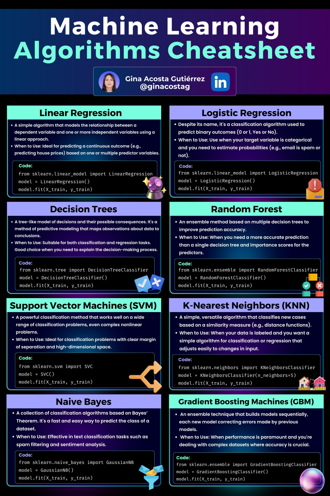
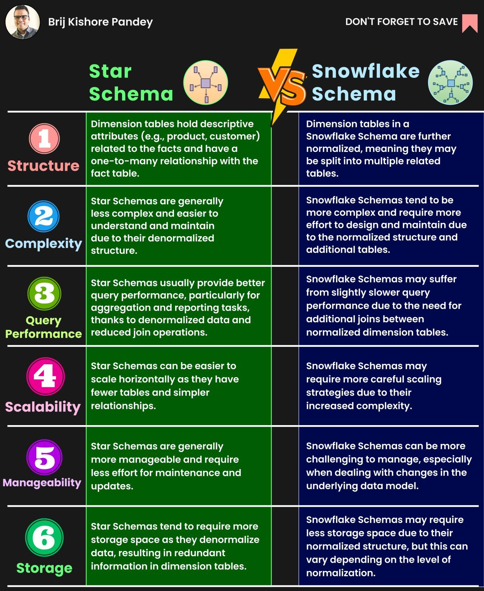
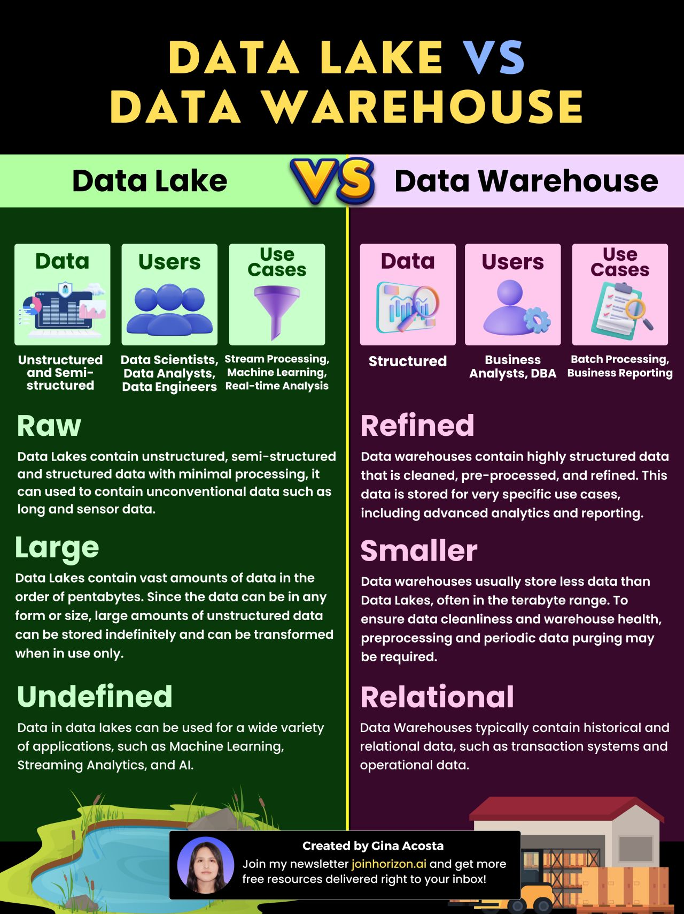

𝗗𝗮𝘁𝗮 𝗘𝗻𝗴𝗶𝗻𝗲𝗲𝗿𝗶𝗻𝗴 𝗧𝗲𝗿𝗺𝘀 𝗬𝗼𝘂 𝗡𝗲𝗲𝗱 𝘁𝗼 𝗞𝗻𝗼𝘄!

If you're into data engineering, knowing these terms will help you work with data storage, moving data around, and making sense of it all.

⚙ 𝗗𝗮𝘁𝗮 𝗣𝗶𝗽𝗲𝗹𝗶𝗻𝗲: An automated process that moves and prepares data.
💾 𝗗𝗮𝘁𝗮𝗯𝗮𝘀𝗲 [Link to Section 2](#𝗗𝗮𝘁𝗮𝗯𝗮𝘀𝗲): An organized collection of data for easy access.

📋 𝗦𝗰𝗵𝗲𝗺𝗮: The blueprint defining a database's structure.
💡 𝗧𝗮𝗯𝗹𝗲: A structured grid containing related data points.

🏠 𝗗𝗮𝘁𝗮 𝗪𝗮𝗿𝗲𝗵𝗼𝘂𝘀𝗲: A central hub for integrated data analysis.
⤵️ 𝗘𝗧𝗟: Extract, Transform, Load - The traditional way to extract, clean, and load data.
⤴️ 𝗘𝗟𝗧: Extract, Load, Transform - The modern approach of loading data first, then transforming it.

🏞️ 𝗗𝗮𝘁𝗮 𝗟𝗮𝗸𝗲: Massive storage for raw, unorganized data.
⏱️ 𝗕𝗮𝘁𝗰𝗵 𝗣𝗿𝗼𝗰𝗲𝘀𝘀𝗶𝗻𝗴: Processing data in large chunks at set times.
⏱️ 𝗦𝘁𝗿𝗲𝗮𝗺 𝗣𝗿𝗼𝗰𝗲𝘀𝘀𝗶𝗻𝗴: Processing data in real-time as it arrives.

📊 𝗗𝗮𝘁𝗮 𝗠𝗮𝗿𝘁: A specific slice of a data warehouse for a particular domain.
🔍 𝗗𝗮𝘁𝗮 𝗤𝘂𝗮𝗹𝗶𝘁𝘆: Ensuring data accuracy, consistency, and reliability.
🕸️ 𝗗𝗮𝘁𝗮 𝗠𝗼𝗱𝗲𝗹𝗶𝗻𝗴: Designing the logical structure and connections of data.

🌊 𝗗𝗮𝘁𝗮 𝗟𝗮𝗸𝗲𝗵𝗼𝘂𝘀𝗲: Combines the flexibility of a data lake with a data warehouse's structure.
🎻 𝗗𝗮𝘁𝗮 𝗢𝗿𝗰𝗵𝗲𝘀𝘁𝗿𝗮𝘁𝗶𝗼𝗻: Coordinating and managing complex data workflows.
🔎 𝗗𝗮𝘁𝗮 𝗟𝗶𝗻𝗲𝗮𝗴𝗲: Tracing a data's origin and journey through its use.

𝗗𝗮𝘁𝗮 𝗜𝗻𝘁𝗲𝗴𝗿𝗮𝘁𝗶𝗼𝗻 𝗧𝗲𝗰𝗵𝗻𝗶𝗾𝘂𝗲𝘀

- 𝗗𝗮𝘁𝗮 𝗘𝘅𝘁𝗿𝗮𝗰𝘁𝗶𝗼𝗻: Learn both full and incremental data extraction methods.

- 𝗗𝗮𝘁𝗮 𝗟𝗼𝗮𝗱𝗶𝗻𝗴:

 - 𝗗𝗮𝘁𝗮𝗯𝗮𝘀𝗲𝘀: Master the techniques of insert-only, insert-update, and comprehensive insert-update-delete operations.

 - 𝗙𝗶𝗹𝗲𝘀: Understand how to replace files or append data within a folder.

𝗗𝗮𝘁𝗮 𝗧𝗿𝗮𝗻𝘀𝗳𝗼𝗿𝗺𝗮𝘁𝗶𝗼𝗻 𝗦𝘁𝗿𝗮𝘁𝗲𝗴𝗶𝗲𝘀

- 𝗗𝗮𝘁𝗮𝗙𝗿𝗮𝗺𝗲𝘀: Acquire skills in manipulating CSV and Parquet file data with tools like Pandas and Polars.

- 𝗦𝗤𝗟: Enhance your ability to transform data within PostgreSQL databases using SQL. 

This includes executing complex aggregations with window functions, breaking down transformation logic with Common Table Expressions (CTEs), and applying transformations in open-source databases such as PostgreSQL.

𝗗𝗮𝘁𝗮 𝗢𝗿𝗰𝗵𝗲𝘀𝘁𝗿𝗮𝘁𝗶𝗼𝗻 𝗙𝘂𝗻𝗱𝗮𝗺𝗲𝗻𝘁𝗮𝗹𝘀

- Develop the ability to create a Directed Acyclic Graph (DAG) using Python.

- Gain expertise in generating logs for monitoring code execution and incorporate logging into databases like PostgreSQL. Learn to trigger alerts for failed runs.

- Familiarize yourself with scheduling Python DAGs using cron expressions.

## Database
1. 𝗦𝗽𝗮𝘁𝗶𝗮𝗹 𝗗𝗮𝘁𝗮𝗯𝗮𝘀𝗲𝘀: Handle spatial data, perfect for applications involving maps, GIS, and location-based services. Ideal for navigating a world of coordinates!

2. 𝗜𝗻-𝗠𝗲𝗺𝗼𝗿𝘆 𝗗𝗮𝘁𝗮𝗯𝗮𝘀𝗲𝘀: Lightning-fast data retrieval by storing everything in RAM. Perfect for applications where speed is of the essence.

3. 𝗗𝗶𝘀𝘁𝗿𝗶𝗯𝘂𝘁𝗲𝗱 𝗗𝗮𝘁𝗮𝗯𝗮𝘀𝗲𝘀: Spread your data across multiple servers, ensuring scalability, fault tolerance, and improved performance in a distributed environment.

4. 𝗥𝗲𝗹𝗮𝘁𝗶𝗼𝗻𝗮𝗹 𝗗𝗮𝘁𝗮𝗯𝗮𝘀𝗲𝘀: Classic and structured, these databases use tables to organize and link data, adhering to the principles of relational algebra. Think SQL databases!

5. 𝗚𝗿𝗮𝗽𝗵 𝗗𝗮𝘁𝗮𝗯𝗮𝘀𝗲𝘀: Unravel complex relationships in data through nodes and edges, making them perfect for social networks, fraud detection, and network analysis.

6. 𝗧𝗶𝗺𝗲-𝗦𝗲𝗿𝗶𝗲𝘀 𝗗𝗮𝘁𝗮𝗯𝗮𝘀𝗲𝘀: Tailored for managing time-stamped data, crucial for applications involving IoT, financial trading, and system monitoring.

7. 𝗢𝗯𝗷𝗲𝗰𝘁-𝗢𝗿𝗶𝗲𝗻𝘁𝗲𝗱 𝗗𝗮𝘁𝗮𝗯𝗮𝘀𝗲𝘀: Like Relational Databases, but they store data in objects, mirroring real-world entities. Perfect for systems where data is naturally object-oriented.

8. 𝗡𝗼𝗦𝗤𝗟 𝗗𝗮𝘁𝗮𝗯𝗮𝘀𝗲𝘀: Perfect for unstructured or semi-structured data, allowing you to manage a variety of data types efficiently. They offer horizontal scalability, high availability, and flexibility in schema design.

9. 𝗩𝗲𝗰𝘁𝗼𝗿 𝗗𝗮𝘁𝗮𝗯𝗮𝘀𝗲𝘀: Harness the power of vectors to handle complex mathematical computations efficiently, ideal for applications like machine learning and data analytics.

Understanding their differences is not just about knowledge, it's about making informed decisions for efficient and effective data handling.

𝟭. 𝗟𝗶𝗻𝗲𝗮𝗿 𝗥𝗲𝗴𝗿𝗲𝘀𝘀𝗶𝗼𝗻: Imagine you want to predict the price of a house based on its size. Linear regression helps you find the straight-line relationship between size and price.

𝟮. 𝗟𝗼𝗴𝗶𝘀𝘁𝗶𝗰 𝗥𝗲𝗴𝗿𝗲𝘀𝘀𝗶𝗼𝗻: Contrary to what the name suggests, this is actually for classification tasks. It helps you decide if an email is spam or not by calculating the probability.

𝟯. 𝗗𝗲𝗰𝗶𝘀𝗶𝗼𝗻 𝗧𝗿𝗲𝗲𝘀: These are like flowcharts that lead you to a decision by asking a series of questions based on the data's features.

𝟰. 𝗥𝗮𝗻𝗱𝗼𝗺 𝗙𝗼𝗿𝗲𝘀𝘁: This one builds a whole 'forest' of decision trees and merges them to get more accurate and stable predictions.

𝟱. 𝗦𝘂𝗽𝗽𝗼𝗿𝘁 𝗩𝗲𝗰𝘁𝗼𝗿 𝗠𝗮𝗰𝗵𝗶𝗻𝗲𝘀 (𝗦𝗩𝗠): If your data points are apples and oranges, SVM finds the best line that separates the apples from the oranges.

𝟲. 𝗞-𝗡𝗲𝗮𝗿𝗲𝘀𝘁 𝗡𝗲𝗶𝗴𝗵𝗯𝗼𝗿𝘀 (𝗞𝗡𝗡): This algorithm looks at the closest data points, like neighbors, to decide the category of a new point.

𝟳. 𝗡𝗮𝗶𝘃𝗲 𝗕𝗮𝘆𝗲𝘀: It's based on probability and is really good for things like filtering spam or analyzing sentiment.

𝟴. 𝗚𝗿𝗮𝗱𝗶𝗲𝗻𝘁 𝗕𝗼𝗼𝘀𝘁𝗶𝗻𝗴 𝗠𝗮𝗰𝗵𝗶𝗻𝗲𝘀 (𝗚𝗕𝗠): This is like a smart assembly line, where each new machine corrects the mistakes of the previous one to improve results.

𝗗𝗮𝘁𝗮 𝗠𝗼𝗱𝗲𝗹𝗶𝗻𝗴 - 𝗧𝗵𝗲 𝗕𝗹𝘂𝗲𝗽𝗿𝗶𝗻𝘁 𝗳𝗼𝗿 𝗗𝗮𝘁𝗮 𝗦𝘂𝗰𝗰𝗲𝘀𝘀

Data Modeling is the art and science of creating a structured framework to handle the influx and storage of data. It's like the architectural blueprint of your data environment, ensuring efficiency, consistency, and scalability. In essence, it's your roadmap for data success.

📘 𝗖𝗼𝗿𝗲 𝗖𝗼𝗻𝗰𝗲𝗽𝘁𝘀 𝗶𝗻 𝗜𝗻𝗳𝗼𝗿𝗺𝗮𝘁𝗶𝗼𝗻 𝗠𝗼𝗱𝗲𝗹𝗶𝗻𝗴
𝗦𝗰𝗵𝗲𝗺𝗮: This acts as the guidebook for your database, defining how information is structured and establishing the connections between different data fragments.
𝗙𝗮𝗰𝘁 𝗧𝗮𝗯𝗹𝗲: This serves as the central storage 🏦 for all the essential metrics and performance indicators. It's the nucleus of your data cosmos.
𝗗𝗶𝗺𝗲𝗻𝘀𝗶𝗼𝗻 𝗧𝗮𝗯𝗹𝗲𝘀: Encircling your fact table, these tables contain illustrative, textual, or categorial details. Consider them as the backdrop to your metrics.

🌟 𝗧𝘄𝗼 𝗠𝗮𝗶𝗻 𝗧𝘆𝗽𝗲𝘀 𝗼𝗳 𝗗𝗮𝘁𝗮 𝗗𝗲𝘀𝗶𝗴𝗻 𝗶𝗻 𝗗𝗮𝘁𝗮 𝗪𝗮𝗿𝗲𝗵𝗼𝘂𝘀𝗲𝘀

1. 𝗦𝘁𝗮𝗿 𝗦𝗰𝗵𝗲𝗺𝗮 🌟
𝗪𝗵𝗮𝘁 𝗶𝘀 𝗶𝘁?: In a Star Schema, the fact table takes its central position, directly linked to various dimension tables.
𝗣𝗿𝗼𝘀: Extremely user-friendly and ensures rapid query performances.
𝗖𝗼𝗻𝘀: Potential data redundancy issues.

2. 𝗦𝗻𝗼𝘄𝗳𝗹𝗮𝗸𝗲 𝗦𝗰𝗵𝗲𝗺𝗮 ❄️
𝗪𝗵𝗮𝘁 𝗶𝘀 𝗶𝘁?: The Snowflake Schema elevates it a notch by normalizing dimension tables into sub-dimensions, forming a hierarchy.
𝗣𝗿𝗼𝘀: Highly normalized, minimizing data redundancy.
𝗖𝗼𝗻𝘀: More intricate queries and potential sluggishness.

𝗦𝗼, 𝗪𝗵𝗶𝗰𝗵 𝗢𝗻𝗲 𝘁𝗼 𝗖𝗵𝗼𝗼𝘀𝗲?
𝗚𝗼 𝗦𝘁𝗮𝗿 🌟: If you're after simplicity and quicker query outcomes.
𝗣𝗶𝗰𝗸 𝗦𝗻𝗼𝘄𝗳𝗹𝗮𝗸𝗲 ❄️: If you're concerned about data storage and normalization.

𝗗𝗮𝘁𝗮 𝗟𝗮𝗸𝗲 𝘃𝘀 𝗗𝗮𝘁𝗮 𝗪𝗮𝗿𝗲𝗵𝗼𝘂𝘀𝗲: 𝗞𝗲𝘆 𝗗𝗶𝗳𝗳𝗲𝗿𝗲𝗻𝗰𝗲𝘀 👨‍💻

When building a data analytics infrastructure, two technologies often come to mind - data lakes and data warehouses. But when should you choose one over the other? Here's a look at their key differences and strengths:

🌊 𝗗𝗮𝘁𝗮 𝗟𝗮𝗸𝗲𝘀: Flexible Storage and Analytics for Varied Data
Data lakes can store any type of data, both structured and unstructured, including text, images, video, audio, and more. With this flexibility, data lakes are ideal for machine learning, artificial intelligence, and advanced analytics on large volumes of varied data. Their scalability accommodates huge datasets. Data lakes allow you to store data now and decide how to use it later.

🏠 𝗗𝗮𝘁𝗮 𝗪𝗮𝗿𝗲𝗵𝗼𝘂𝘀𝗲𝘀: Structured and Optimized for BI Workloads
Data warehouses store structured, optimized data that's been cleaned and processed for downstream analytics. Their relational structure and optimization makes them ideal for predefined workloads like business intelligence, reporting, and dashboards. But data warehouses lack flexibility for unstructured data and can't scale to massive datasets cost-effectively.

Overall, data lakes provide flexibility and scalability for exploratory analytics on varied data, while data warehouses are tailored for structured data and predefined workloads. Assess your use cases, data types and volumes, performance needs, and costs to choose the right technology for your needs.

𝗗𝗮𝘁𝗮𝗯𝗿𝗶𝗰𝗸𝘀 𝘃𝘀. 𝗦𝗻𝗼𝘄𝗳𝗹𝗮𝗸𝗲: 𝗔 𝗖𝗼𝗺𝗽𝗮𝗿𝗶𝘀𝗼𝗻 🥊☁

With data volumes surging, picking the right cloud data warehouse is critical. Let's explore how leading options Databricks and Snowflake compare.

⚡ 𝗗𝗮𝘁𝗮𝗯𝗿𝗶𝗰𝗸𝘀:
- Unified analytics platform optimized for big data
- Leverages Spark for scalable distributed processing
- Supports real-time streaming analytics
- Easy integration with ML libraries like TensorFlow

❄ 𝗦𝗻𝗼𝘄𝗳𝗹𝗮𝗸𝗲:
- Cloud-native data warehouse designed for flexibility
- Segregates storage and compute for scalability
- Fast performance for high-concurrency SQL analytics
- Virtual warehouses provide tunable resources

𝗞𝗲𝘆 𝗗𝗶𝗳𝗳𝗲𝗿𝗲𝗻𝗰𝗲𝘀:
Databricks excels at big data workflows and advanced analytics while Snowflake powers SQL analytics and serves as a cloud data warehouse. Databricks offers better support for unstructured data while Snowflake specializes in structured data.

𝗨𝘀𝗲 𝗖𝗮𝘀𝗲𝘀:
Databricks shines for ETL, machine learning, and real-time analytics. Snowflake is ideal for BI and data sharing use cases that require querying large datasets.

𝗖𝗼𝗻𝗰𝗹𝘂𝘀𝗶𝗼𝗻:
Databricks and Snowflake both deliver robust analytics capabilities through different approaches. Understanding their respective strengths and aligning them to your use cases is key to choosing the right platform. Evaluating your requirements and data infrastructure will determine which solution fits best. With clear goals, you can leverage these technologies for impactful data insights!

The term 'Data Lake' might sound like tech jargon, but let's demystify it.

Introduced in the early 2010s, a Data Lake is a centralized repository designed to store vast amounts of raw data, irrespective of its source or format. 

Unlike traditional systems, it doesn't discriminate – structured, semi-structured, or unstructured; it welcomes all types of data. 

𝗧𝗵𝗲 𝗶𝗱𝗲𝗮? 

To have a single source of truth, ready to be analyzed when needed.

Here's a step-by-step journey through a Data Lake:

1.𝗗𝗮𝘁𝗮 𝗜𝗻𝗴𝗲𝘀𝘁𝗶𝗼𝗻:
Firstly, we collect data from varied sources:
- 📜 Logs: Diagnostic records.
- 🌐 Social Media: Capturing real-time sentiments.
- ☁️ Cloud: A reservoir of scalable resources.
- 🔄 ERP/CRM: The epicenter of your business operations.
- 📂 Flat Files & 🗃️ OLTP: Simplicity and real-time transactions.

2.𝗘𝗧𝗟 𝗣𝗿𝗼𝗰𝗲𝘀𝘀:
Once data enters the system, the ETL (Extract, Transform, Load) process kicks in. This is where data is cleansed, transformed, and made ready for analysis.

3.𝗦𝘁𝗼𝗿𝗮𝗴𝗲 𝗮𝗻𝗱 𝗠𝗮𝗻𝗮𝗴𝗲𝗺𝗲𝗻𝘁:
The Data Lake has distinct zones:
- 🔶 𝗕𝗿𝗼𝗻𝘇𝗲 𝗭𝗼𝗻𝗲: Raw data's initial resting place.
- 🔷 𝗦𝗶𝗹𝘃𝗲𝗿 𝗭𝗼𝗻𝗲: The transformation stage where data is cleaned and structured.
- 🥇 𝗚𝗼𝗹𝗱 𝗭𝗼𝗻𝗲: Here, data is refined, trusted, and ready for consumption.

🛡️ 𝗦𝗲𝗰𝘂𝗿𝗶𝘁𝘆: Ensuring data integrity and protection.
🔍 𝗦𝗲𝗮𝗿𝗰𝗵: Efficiently find the data you need.
🌐 𝗚𝗼𝘃𝗲𝗿𝗻 𝗭𝗼𝗻𝗲: Where data management policies reside to maintain data quality and compliance.

🔽 𝗗𝗮𝘁𝗮 𝗖𝗼𝗻𝘀𝘂𝗺𝗽𝘁𝗶𝗼𝗻: The final frontier where data meets its destiny – be it in analytics, machine learning models, or business reports.

Remember, the essence of a Data Lake is not just in its storage but how effectively we can transform raw data into actionable insights. 

As data volumes grow, databases often struggle to keep up with performance demands. 

One powerful technique to scale databases is sharding - horizontally partitioning data across multiple databases.

Vertical Partitioning splits tables by columns, with different columns stored in separate tables. This allows frequently accessed columns to be separated for faster querying.

Horizontal Partitioning, in contrast, involves splitting a table across different databases by rows. Large tables are divided into smaller shards that can be queried in parallel.

𝗞𝗲𝘆-𝗯𝗮𝘀𝗲𝗱 𝘀𝗵𝗮𝗿𝗱𝗶𝗻𝗴 determines the shard for each row based on the value of a "shard key" column. Records with shard key values in a certain range are stored together. 

𝗥𝗮𝗻𝗴𝗲-𝗯𝗮𝘀𝗲𝗱 𝘀𝗵𝗮𝗿𝗱𝗶𝗻𝗴 is a variation where ranges of shard key values are allocated to each shard. The infographic shows an example where products priced $120-150 are in one shard, $151-500 in another, and $501+ in a third shard. This enables fine-grained allocation of key ranges to shards based on value distribution.

𝗗𝗶𝗿𝗲𝗰𝘁𝗼𝗿𝘆-𝗯𝗮𝘀𝗲𝗱 𝘀𝗵𝗮𝗿𝗱𝗶𝗻𝗴 adds a lookup table that maps a shard key to the database shard, allowing more flexibility than key-based sharding in allocating data to shards.

Sharding is a great way to achieve horizontal scaling and handle increasing data volumes. 

